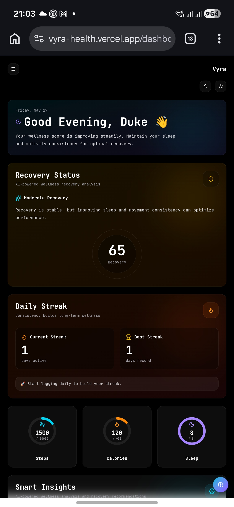
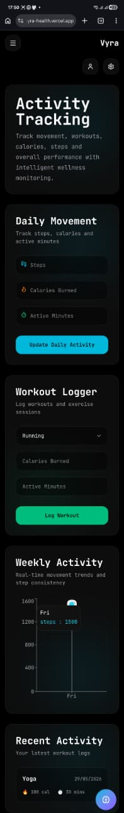
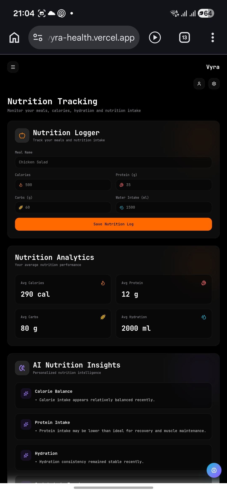
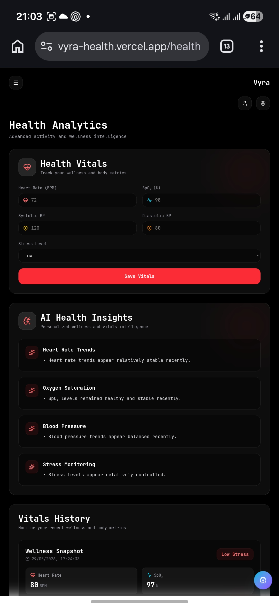
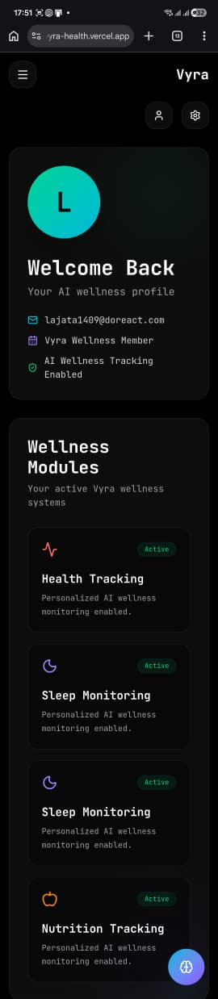
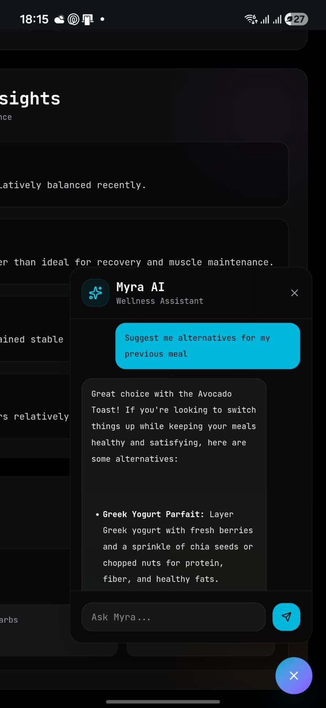
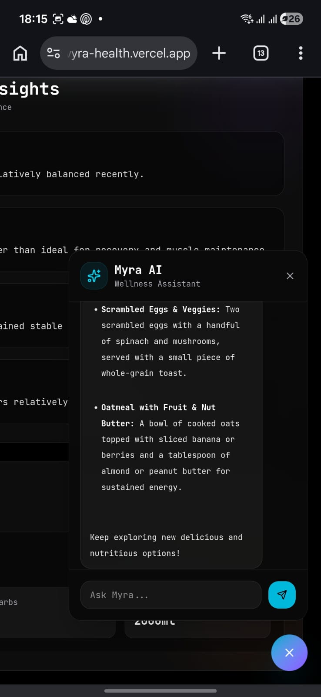

# 🩺 Vyra — AI-Powered Wellness Platform

## 🌟 What is Vyra?

**Vyra** is an AI-powered wellness platform designed to help individuals take control of their health through intelligent tracking, personalized insights, and proactive wellness recommendations.

The name **Vyra** is derived from two concepts:

* **Vitals** — representing measurable aspects of health such as activity, sleep, nutrition, and overall wellness.
* **Aura** — representing the invisible yet impactful state of a person's physical and mental well-being.

Together, **Vyra** embodies the idea that true wellness is a combination of what can be measured and what can be felt.

---

## 💡 Inspiration

In today's world, people use multiple applications to monitor different aspects of their health.

* One application tracks workouts.
* Another tracks sleep.
* A different one tracks nutrition.

While these tools collect valuable information, they rarely provide a unified understanding of a person's overall well-being.

**Vyra was created to bridge this gap.**

The vision behind Vyra was to build a single platform where users could:

* Monitor their daily wellness habits
* Understand long-term health trends
* Receive intelligent recommendations
* Interact with an AI wellness companion that understands their health data

Instead of simply displaying numbers, Vyra transforms personal wellness data into meaningful insights.

---

## 🚀 Features

### 🔐 Secure Authentication

* User Registration & Login
* Session Management
* User-Specific Wellness Records
* Supabase Authentication

---

### 📊 Dashboard Analytics

* Personalized Dashboard
* Wellness Score Monitoring
* Recovery Insights
* Activity Summaries
* Interactive Data Visualization

---

### 🏃 Activity Tracking

Track daily movement and exercise routines.

#### Features

* Daily Step Tracking
* Workout Logging
* Weekly Activity Charts
* Activity History
* Calorie Expenditure Tracking

---

### 😴 Sleep Monitoring

Gain visibility into recovery and rest patterns.

#### Features

* Sleep Duration Logging
* Sleep Quality Tracking
* Weekly Sleep Analytics
* Sleep History Monitoring

---

### 🥗 Nutrition Tracking

Monitor dietary habits and nutritional intake.

#### Features

* Nutrition Logging
* Calorie Tracking
* Meal History Management
* Wellness-Focused Nutrition Insights

---

### ❤️ Health Monitoring

Track important health metrics.

#### Features

* Heart Rate Tracking
* Blood Pressure Tracking
* General Wellness Indicators
* Historical Health Records

---

### 🤖 Myra — AI Wellness Assistant

Vyra includes an AI-powered wellness companion named **Myra**.

Myra acts as a personalized wellness coach by analyzing user wellness data and providing contextual recommendations.

#### Capabilities

* Wellness Guidance
* Recovery Recommendations
* Activity Suggestions
* Sleep Improvement Tips
* Nutrition Support
* Personalized Responses Based on User Data

Unlike traditional chatbots, Myra leverages user-generated wellness data to deliver context-aware assistance.

---

## 🛠️ Technology Stack

### Frontend

* Next.js
* TypeScript
* Tailwind CSS
* Framer Motion
* Recharts

### Backend

* Supabase
* PostgreSQL
* Row Level Security (RLS)

### Artificial Intelligence

* Google Gemini Flash API

### Deployment

* Vercel

---

## 🏗️ System Architecture

```text
User
  │
  ▼
Next.js Application
  │
  ▼
Supabase Database
  │
  ├── Authentication
  ├── Activity Logs
  ├── Sleep Logs
  ├── Nutrition Logs
  └── Health Metrics
  │
  ▼
Gemini AI (Myra)
  │
  ▼
Personalized Wellness Insights
```

---

## 🎯 Future Roadmap

Planned enhancements include:

* Apple Health Integration
* Google Fit Integration
* Wearable Device Connectivity
* Advanced Wellness Scoring Algorithms
* Personalized Recovery Planning
* Mobile Application
* Wellness Report Exports

---

## 📸 Screenshots

## 📸 Screenshots

| Dashboard | Activity |
|------------|------------|
|  |  |

| Sleep | Nutrition |
|------------|------------|
|  |  |

| Health | Profile |
|------------|------------|
|  |  |

## 🤖 Myra AI Assistant





---

## 🌐 Live Demo

🔗 https://vyra-health.vercel.app

---

## 👨‍💻 Author

### Kalyan Gutta

**Master of Science in Computer Science**
University of South Florida

Passionate about:

* Artificial Intelligence
* Data Science
* Full-Stack Development
* Human-Centered Technology

---

⭐ If you found this project interesting, feel free to star the repository.
